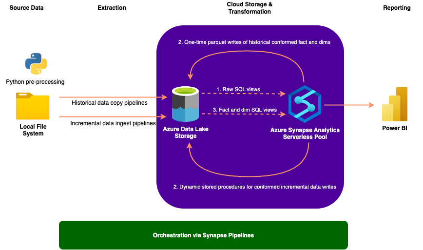
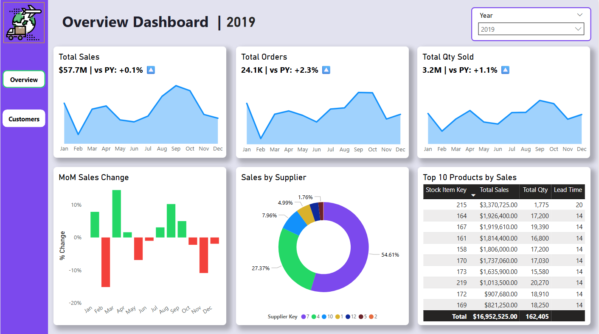
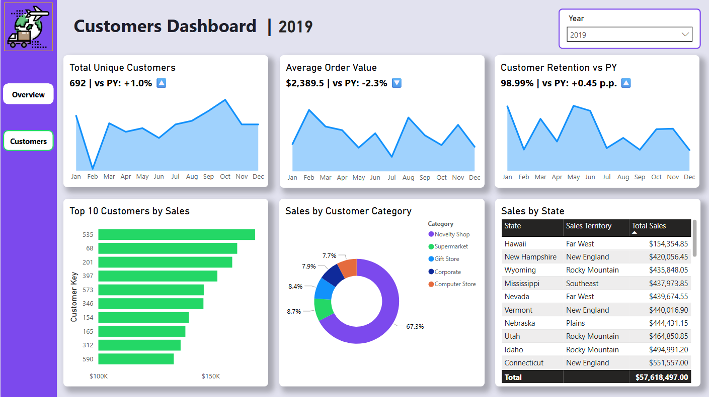

# World Wide Importers Logical Data Warehouse Project

## Overview

This project implements a logical data warehouse (LDW) in an Azure Synapse Analytics serverless pool. The data comes from downloaded CSV versions of the normalized World Wide Importers (WWI) database. 

To simulate daily incremental ingestion, the dataset was processed in two phases:
- Initial Full Load: Historical records (with `ValidFrom` ≤ 2019-12-31) are processed and loaded into conformed dimension and fact tables

- Incremental Daily Loads: Records with `ValidFrom` > 2019-12-31, including python-simulated randomly generated updates for existing customers and suppliers, are partitioned by `ValidFrom` to mimic sequential daily ingestion until the last date of data: 2021-04-17

This approach enables testing ETL pipelines, handling of slowly changing dimensions, and incremental fact loading without needing actual future data, closely simulating a real-world data warehouse workflow. The LDW is designed to be modular, scalable, and analytics-ready, supporting downstream BI tools such as Power BI or Tableau.

## Features

- <u>Initial & Incremental Data Processing</u>

    - All data uploaded from on-premises file system to ADLs via a self-hosted integration runtime
    - Reads historical CSVs from ADLs into raw SQL views
    - Leveraging partition pruning, warehouse captures incremental changes for Customers, Suppliers, Cities, Countries, and StateProvinces tables, as well as incremental sales data

- <u>Conformed Dimensions</u>
    - Raw dimension data is transformed into conformed Customers, Suppliers, StockItems, and Date dimensions
    - Conformed dimensions unify reference data across the warehouse for consistent analytics

- <u>SCD Type 2 Logic</u>
    - Tracks historical changes in the fields of Customers and Suppliers tables
    - Ensures accurate historical analysis while keeping latest record easily identifiable

- <u>Fact Table Construction</u>
    - Fact Sales table integrates Orders, OrderLines, Customers, StockItems, and Suppliers, ensuring accurate point-in-time analysis through SCD-valid dimension joins for  Customers and Suppliers
    - Supports analytics at multiple levels: order, customer, product, supplier

- <u>External Table Storage</u>
    - All conformed dimensions and fact tables written to ADLS as Parquet files; final warehouse fact and dimension views are built on top of these Parquet files
    - Optimized for performance and downstream consumption

- <u>Automated Incremental Load</u>
    - Stored procedures update conformed fact and dimensions incrementally
    - Scheduled pipelines ensure daily ingestion of on-premise data to ADLs and execution of stored procedures for transformations

- <u>Latest Views for Reference Data</u>
    - Cities, Countries, and StateProvinces are read as “latest” views.
    - Changes automatically propagate to dependent dimensions

## Tech Stack
- Python
    - pandas
    - numpy
- Azure Data Lake Storage Gen2
- Azure Synapse Analytics 
    - Serverless pool
    - Synapse pipelines
- Power BI Desktop
- Visual Studio Code

## ETL Architecture

## Logical Data Warehouse Schema

## Power BI Highlights
**Dashboard 1:**

**Dashboard 2:**

## How to Use

**Repository Folder Organization**

- *Downloaded_Initial*: All source CSV files as they were initial downloaded from online
- *Simulation_Initial_Dims*: All historical dimension-like CSVs (`ValidFrom` earlier than 12-31-2019)
- *New_Old_Order_Split*: Date partitioned orders and order lines CSVs split into new (incremental) and historical groups
    - *New_Sales_Order_Data*
    - *New_Sales_Orderline_Data*
    - *Old_Sales_Order_Data*
    - *Old_Sales_Orderline_Data*
- *Changed_Data*: Date partitioned, incremental dimension-like CSVs, contain simulated updates and new data
- *Synapse_Objects*: JSON definitions of all Synapse pipelines, linked services, datasets, and triggers used, as well as all SQL scripts 
- *PowerBI*: All Power BI files and objects
- *Diagrams*: LDW Entity relationship and ETL architecture diagrams
- *Data_Simulation_Script.ipynb*: Python script for light cleaning, data partitioning, and SCD simulation
- *Process_Date_Tracker*: Contains one .txt file to track process date for incremental ingestion pipelines

**Setup Instructions**
1. Clone the repository to your local file system, place all the items into a root directory (this will be the host for self-hosted integration runtime).
2. If you plan on using the existing pre-processed data, you can skip the .ipynb script and Downloaded_Initial folder. Otherwise, run the script to create your version of *Simulated_Initial_Dims* and *Changed_Data* folders; you can still use the *New_Old_Order_Split* folder as this is still raw data - simply split into historical and new.
3. Create and deploy Azure resources:
    - Synapse Analytics workspace (built-in serverless pool)
    - Data Lake Storage Gen 2 (hierarchical namespace)
    - Local self-hosted integration runtime download + setup
4. Create a new container in the data lake called `project-data`; this will house all project data in the lake.
5. Create 5 new folders in the project-data container: `Initial_Dims`, `Changed_Dims`, `Sales_Order`, `Sales_Orderline`, `Process_Date_Tracker`.
6. Upload the .txt file from your local Process_Date_Tracker folder into the lake version of folder.
7. In Synapse Studio, import the *WWI Logical DW Creation Script* file, connect to the built-in serverless pool, run just the first 8 lines of the script (database create and alter commands), then switch the database connection from master to the new database you just created.
8. Import the remaining SQL scripts from local system, hold off on running them.
8. In Synapse Studio, import all the JSON definitions of Synapse objects, excluding datasets `IncrementalCustomersView` and `IncrementalSuppliersView` and all pipelines starting with Staging_*. Make sure to replace placeholder values with your relevant credentials, paths, etc in the definitions.
9. Manually trigger `Ingest_Initial_Dims`, `Ingest_Initial_Orders`, and `Ingest_Initial_OrderLines` pipelines to copy all historical data into the data lake; these will be one-time run pipelines.
10. Run the remainder of the *WWI Logical DW Creation Script*, making sure to replace placeholder values for credentials and external data source. Run the other imported SQL scripts too.
11. Import the previously excluded Synapse objects JSON definitions, once again replacing placeholder values.
12. Run the `Staging_Initial_Sales` pipeline, it may take hours to complete.
13. Ensure scheduled triggering of daily, incremental pipelines: `Ingest_Daily_Order`, `Ingest_Daily_OrderLines`, `Ingest_Daily_Changed_Dims`, `Staging_Incremental_Customers`, `Staging_Incremental_Suppliers`, `Staging_Incremental_Sales`. Note `Ingest_Daily_Changed_Dims` must run after the other 2 ingestion pipelines, all staging pipelines must run after ingestion pipelines, and `Staging_Incremental_Sales`, specifically, should run after the other incremental pipelines.
14. Connect Power BI to final warehouse fact and dim views.

